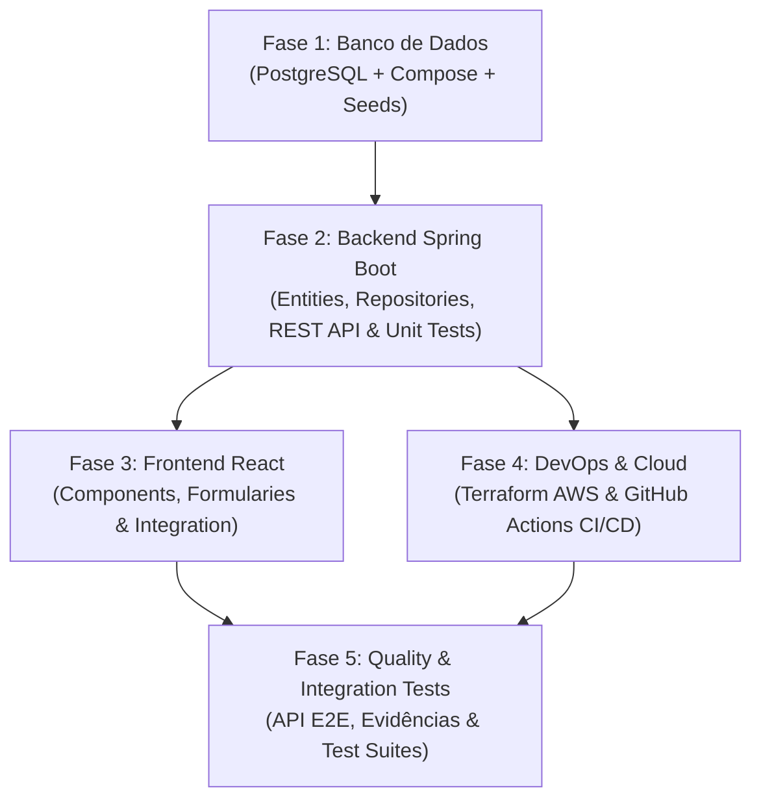

# Plano de Implementação — Projeto Didático `PE_Example`

## 1. Visão Geral do Projeto

Este projeto tem como finalidade servir como **referência didática** para os alunos, demonstrando como organizar, desenvolver e integrar as 5 disciplinas/times principais presentes no projeto real (`C:\projetos\plataforma`):

1. **`banco_dados`**: Persistência relacionais com PostgreSQL, Docker Compose e scripts de migração DDL/DML.
2. **`backend`**: API RESTful em Java 21 com Spring Boot 3, Spring Data JPA e validações.
3. **`frontend`**: Aplicação Web responsiva em React (TypeScript) consumindo os serviços REST do backend.
4. **`devops`**: Infraestrutura como código (IaC) com Terraform para AWS e automação CI/CD via GitHub Actions.
5. **`quality`**: Estratégia de testes de software (unitários, integração REST, E2E e validação de contratos).

### Escopo Simplificado
Para garantir foco pedagógico sem complexidades desnecessárias, o sistema contemplará exclusivamente 2 módulos:
- **CRUD de Usuários** (id, nome, email, tipo: `ALUNO`, `PROFESSOR`, `ADMINISTRADOR`, status: `ATIVO`, `INATIVO`).
- **CRUD de Projetos de Extensão** (id, titulo, descricao, coordenador_id, status: `EM_ANALISE`, `EM_ANDAMENTO`, `CONCLUIDO`, data_inicio, data_fim).

---

## 2. Estrutura de Arquivos e Diretórios Target

```
PE_Example/
├── banco_dados/
│   ├── compose.yaml
│   ├── migrations/
│   │   └── V1__create_tables.sql
│   ├── seeds/
│   │   └── V2__insert_initial_data.sql
│   └── README.md
├── backend/
│   ├── pom.xml
│   ├── Dockerfile
│   ├── src/
│   │   ├── main/
│   │   │   ├── java/br/senai/peexample/
│   │   │   │   ├── model/ (Usuario, ProjetoExtensao, Enums)
│   │   │   │   ├── repository/
│   │   │   │   ├── dto/
│   │   │   │   ├── service/
│   │   │   │   ├── controller/
│   │   │   │   └── exception/
│   │   │   └── resources/
│   │   │       └── application.yml
│   │   └── test/ (Testes Unitários com JUnit 5 e Mockito)
│   └── README.md
├── frontend/
│   ├── package.json
│   ├── vite.config.ts
│   ├── Dockerfile
│   ├── src/
│   │   ├── components/ (Navbar, Layout, Table, FormModal)
│   │   ├── pages/ (Usuarios, ProjetosExtensao)
│   │   ├── services/ (api.ts - Axios/Fetch)
│   │   ├── types/ (Usuario.ts, ProjetoExtensao.ts)
│   │   └── App.tsx
│   └── README.md
├── devops/
│   ├── terraform/
│   │   ├── main.tf
│   │   ├── variables.tf
│   │   ├── outputs.tf
│   │   └── modules/ (vpc, rds, app_runner/ecs)
│   ├── github_actions/ (Exemplos reutilizáveis de Workflows)
│   └── README.md
├── quality/
│   ├── tests/
│   │   ├── api/ (Testes de integração REST / Newman / RestAssured)
│   │   └── e2e/ (Testes de ponta a ponta UI com Cypress / Playwright)
│   ├── docs/ (Plano e Estratégia de Qualidade)
│   └── README.md
└── .github/
    └── workflows/
        ├── backend-ci.yml
        ├── frontend-ci.yml
        └── infra-ci.yml
```

---

## 3. Fases e Etapas de Execução



### **Fase 1 — Time de Banco de Dados (`banco_dados`)**
- [ ] Configurar `compose.yaml` para levantar PostgreSQL 16 na porta `5432`.
- [ ] Criar script DDL `V1__create_tables.sql` com tabelas `tb_usuario` e `tb_projeto_extensao` com Chave Estrangeira.
- [ ] Criar script DML `V2__insert_initial_data.sql` populando a base com usuários e projetos demonstrativos.
- [ ] Escrever `README.md` orientando o aluno a subir e resetar a base local.

### **Fase 2 — Time de Backend (`backend`)**
- [ ] Inicializar projeto Maven Spring Boot 3 (Java 21) com `spring-boot-starter-web`, `spring-boot-starter-data-jpa`, `postgresql`, `validation`, `lombok`.
- [ ] Configurar `application.yml` apontando para o container Postgres local.
- [ ] Implementar entidades `Usuario` e `ProjetoExtensao`.
- [ ] Criar DTOs de Entrada (`Request`) e Saída (`Response`) desacoplados das entidades.
- [ ] Implementar `Service` com regras de negócio (ex: validação de e-mail único, verificação do coordenador existir).
- [ ] Implementar `Controller` REST com suporte a paginação e códigos HTTP padronizados (200, 201, 204, 400, 404, 500).
- [ ] Criar tratamento global de exceções (`@RestControllerAdvice`).
- [ ] Desenvolver suíte de **testes unitários** (JUnit 5 + Mockito) para as camadas de Service e Controller.

### **Fase 3 — Time de Frontend (`frontend`)**
- [ ] Criar aplicação React (Vite + TypeScript).
- [ ] Configurar cliente HTTP (Axios/Fetch API) com baseURL configurável (`http://localhost:8080/api`).
- [ ] Criar componentes base de UI (Tabela, Modal de Formulário, Alertas).
- [ ] Construir a página de **Gestão de Usuários**:
  - Listagem com busca/filtro.
  - Form para cadastro e edição.
  - Ação de desativar/excluir.
- [ ] Construir a página de **Projetos de Extensão**:
  - Listagem com exibição do Coordenador.
  - Form para cadastro vinculando um Usuário Coordenador via `<select>`.
- [ ] Escrever README com instruções de `npm install` e `npm run dev`.

### **Fase 4 — Time de DevOps (`devops`)**
- [ ] Criar estrutura Terraform modularizada para AWS:
  - `modules/vpc`: Rede, Subnets e Security Groups.
  - `modules/rds`: Instância PostgreSQL isolada.
  - `modules/app_runner` ou `ecs`: Serviço de hospedagem para a aplicação.
- [ ] Criar pipelines em `.github/workflows/`:
  - `backend-ci.yml`: Compilação Maven, testes unitários e linting.
  - `frontend-ci.yml`: Build Vite, typecheck (TypeScript) e ESLint.
  - `infra-ci.yml`: `terraform fmt` e `terraform validate`.
- [ ] Documentar o fluxo de implantação e variáveis de ambiente necessárias.

### **Fase 5 — Time de Qualidade (`quality`)**
- [ ] Criar coleção de testes de API REST (Postman/Newman ou RestAssured/Playwright API).
- [ ] Validar cenários de sucesso e exceção (criação inválida, ID inexistente, e-mail duplicado).
- [ ] Criar testes de integração E2E simplificados simulando a jornada completa: Cadastrar Usuário -> Cadastrar Projeto associado.
- [ ] Elaborar modelo de relatório de evidências de testes para orientação dos alunos.

---

## 4. Próximos Passos Recomendados

1. **Aprovação do Plano**: Validar com o professor/instrutor a estrutura planejada.
2. **Execução Sequencial**: Iniciar pela **Fase 1 (banco_dados)** e **Fase 2 (backend)** para disponibilizar os serviços para o frontend e demais times.
3. **Criação das Pastas e Inicialização dos Projetos**: Gerar os arquivos base em `c:\projetos\PE_Example`.
