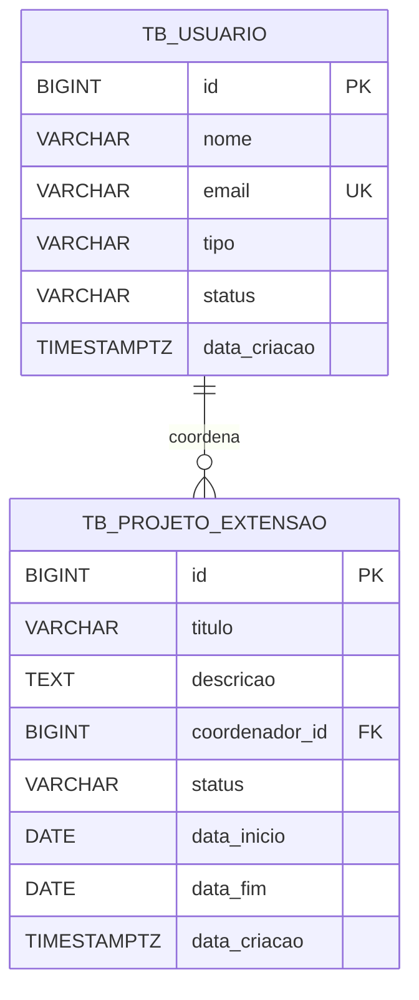

# Módulo de Banco de Dados — `PE_Example`

Este diretório é responsável pela definição, manutenção e versionamento do banco de dados relacional PostgreSQL do projeto didático.

## 📁 Estrutura de Arquivos

- `compose.yaml`: Configuração Docker Compose para o container PostgreSQL 16.
- `migrations/`: Scripts DDL de criação de tabelas e índices.
- `seeds/`: Scripts DML de carga inicial de dados para desenvolvimento local e testes.

## Modelo Entidade-Relacionamento



Cada projeto possui exatamente um coordenador (`coordenador_id` obrigatório), enquanto um usuário pode coordenar nenhum ou vários projetos. A exclusão de um usuário referenciado é restringida pela chave estrangeira.

### Relacionamento (formato textual)

```text
TB_USUARIO (1) ──────────── (0..N) TB_PROJETO_EXTENSAO
             id  ← FK coordenador_id
```

## 🚀 Como Executar

### Subir o sistema completo (recomendado)

Na raiz do repositório, inicie PostgreSQL, API e interface:

```bash
docker compose up --build
```

- Frontend: `http://localhost:3000`
- API: `http://localhost:8080/api`
- PostgreSQL: `localhost:5432` (banco `pe_example`, usuário `postgres`)

O frontend encaminha as chamadas `/api` para o backend dentro da rede Docker. Para substituir a senha didática padrão, defina `POSTGRES_PASSWORD` no ambiente antes de iniciar os serviços.

Encerre os containers preservando os dados com `docker compose down`. Para recriar a base do zero e reaplicar tabelas e seeds, use `docker compose down -v` seguido de `docker compose up --build`.

### Executar somente o banco de dados

Os comandos abaixo mantêm a opção de desenvolvimento isolado do módulo. Execute-os dentro de `banco_dados/`:

#### 1. Iniciar o PostgreSQL

```bash
docker compose up -d
```

O container criará o banco `pe_example` na porta `5432` com usuário `postgres` e senha `postgrespassword`, executando automaticamente os scripts SQL de inicialização.

#### 2. Verificar o status do container

```bash
docker compose ps
```

#### 3. Resetar o banco de dados

Para limpar os dados e recriar as tabelas do zero:

```bash
docker compose down -v
docker compose up -d
```
