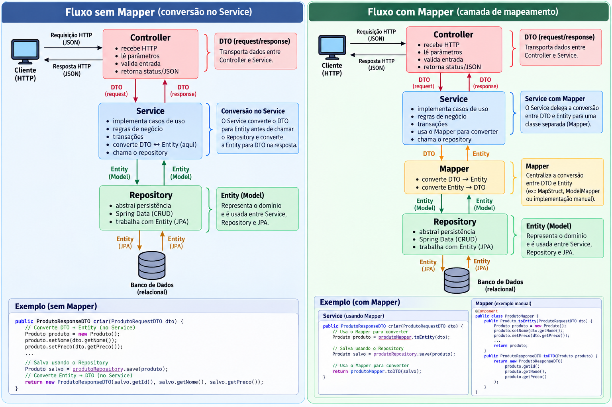

# Apostila de Backend — PE_Example

Este capítulo apresenta o backend do PE_Example, uma API REST construída com Java 21, Spring Boot 3.4.1, Spring Data JPA e PostgreSQL.

## 1. Criação e pré-requisitos

Instale JDK 21 (`java -version`), Maven (`mvn -version`) e Docker Desktop. Uma nova aplicação pode ser criada no Spring Initializr escolhendo Java 21 e as dependências Web, Spring Data JPA, Validation, PostgreSQL, Lombok e Spring Boot Test. Exemplo:

```bash
curl "https://start.spring.io/starter.zip?type=maven-project&language=java&javaVersion=21&bootVersion=3.4.1&groupId=br.senai&artifactId=pe-example-backend&dependencies=web,data-jpa,validation,postgresql,lombok" -o backend.zip
```

O `pom.xml` é o manifesto Maven: identifica o projeto, define Java, dependências e plugins. Neste projeto, o `spring-boot-starter-test` fornece JUnit 5, Mockito e Spring Test; PostgreSQL é usado em runtime e H2 em testes.

## 2. Comandos

Na pasta `backend/`:

```bash
mvn spring-boot:run       # inicia a API
mvn clean                 # remove target/
mvn compile               # compila
mvn test                  # executa testes Java
mvn clean verify          # valida projeto e testes
mvn package               # gera target/*.jar
java -jar target/*.jar    # executa o JAR
```

Na raiz:

```bash
docker compose up --build
docker compose up --build -d
docker compose --profile tests run --rm backend-tests
docker compose logs -f backend
```

A API fica em `http://localhost:8080/api`; as configurações estão em `src/main/resources/application.yml`.

## 3. Arquitetura em camadas

A imagem abaixo relaciona as camadas da arquitetura com o fluxo de uma requisição no backend:



```text
Cliente HTTP → Controller → Service → Repository → PostgreSQL
                    ↓          ↓
                   DTO       Model/Entity
                    ↓
             resposta ou erro HTTP
```

- **Controller**: recebe HTTP, lê parâmetros, valida entrada e retorna status/JSON.
- **Service**: implementa casos de uso, regras de negócio, transações e conversão entidade/DTO.
- **Repository**: abstrai persistência; o Spring Data fornece CRUD sem código SQL manual.
- **Model/Entity**: representa domínio e tabelas JPA.
- **DTO**: define contratos de entrada e saída sem expor diretamente a entidade.
- **Exception**: representa falhas e centraliza sua conversão para respostas HTTP.

Exemplo de fluxo: `POST /api/usuarios` chega ao controller, passa por `@Valid`, chama `UsuarioService`, verifica e-mail, cria `Usuario`, salva pelo repository e retorna `UsuarioDTO`.

## 4. Spring, classes e injeção de dependência

`PeExampleApplication` possui `main` e `@SpringBootApplication`, que combina configuração, descoberta de componentes e auto-configuração. O Spring administra objetos chamados beans e injeta suas dependências.

```java
@Service
@RequiredArgsConstructor
public class UsuarioService {
    private final UsuarioRepository usuarioRepository;
}
```

`@Service` registra o bean e `@RequiredArgsConstructor` do Lombok gera construtor para campos `final`. Assim, o código não usa `new UsuarioService(...)`; a dependência é explícita e fácil de substituir em testes. Injeção por construtor é preferível à injeção diretamente em campos.

## 5. Model, entidade e enum

`Usuario` e `ProjetoExtensao` são entidades JPA. `@Entity`, `@Id`, `@GeneratedValue`, `@Column` e `@Enumerated` mapeiam objetos Java para tabelas e colunas. Enums (`TipoUsuario`, `StatusUsuario`, `StatusProjeto`) restringem valores possíveis; prefira persistência por nome (`EnumType.STRING`) para evitar dependência da posição do enum. Lombok `@Builder` permite `Usuario.builder()...build()`.

## 6. DTO e validação

`UsuarioCreateDTO` representa dados de `POST`/`PUT`; `UsuarioDTO` representa a resposta. Essa separação protege campos internos e permite evoluir o contrato da API. No controller, `@Valid @RequestBody UsuarioCreateDTO dto` aciona Bean Validation antes do service. `@NotBlank`, `@Email`, `@Size` e `@NotNull` validam formato; regras que dependem do banco, como e-mail duplicado, ficam no service.

## 7. Controllers e HTTP

`@RestController` produz JSON; `@RequestMapping("/api/usuarios")` define prefixo; `@GetMapping`, `@PostMapping`, `@PutMapping` e `@DeleteMapping` ligam verbos a métodos; `@PathVariable` lê o ID; `@RequestParam` lê `?busca=ana`; `@RequestBody` converte JSON; `ResponseEntity` define status e corpo.

O projeto usa `200 OK` em consultas/atualizações, `201 CREATED` no cadastro e `204 NO_CONTENT` na remoção. `Pageable` e `@PageableDefault(size = 10, sort = "nome")` tratam paginação (`page`, `size`, `sort`) e `Page` devolve conteúdo e metadados.

## 8. Service, transação e regras

`UsuarioService` implementa listar, buscar, criar, atualizar e deletar. `@Transactional` delimita transação; `@Transactional(readOnly = true)` marca consultas. O service lança `ResourceNotFoundException` para ID inexistente, `BusinessException` para e-mail duplicado, aplica `ATIVO` como padrão e usa `toDTO` para conversão.

## 9. Repository

`UsuarioRepository extends JpaRepository<Usuario, Long>`. O Spring fornece `findAll`, `findById`, `save` e `delete`. Métodos como `existsByEmail` e `findByNomeContainingIgnoreCaseOrEmailContainingIgnoreCase` usam query derivation: o nome descreve a consulta. Consultas mais complexas podem usar `@Query`; regras de negócio não devem ficar no repository.

## 10. Exceções e novo recurso

`GlobalExceptionHandler`, anotado com `@RestControllerAdvice`, transforma exceções em status e JSON consistentes, evitando `try/catch` repetido nos controllers.

Para criar um recurso novo: entidade e migration; DTOs; repository; service; controller; exceções; testes; documentação. Mantenha a direção controller → service → repository e rode `mvn clean verify`.
